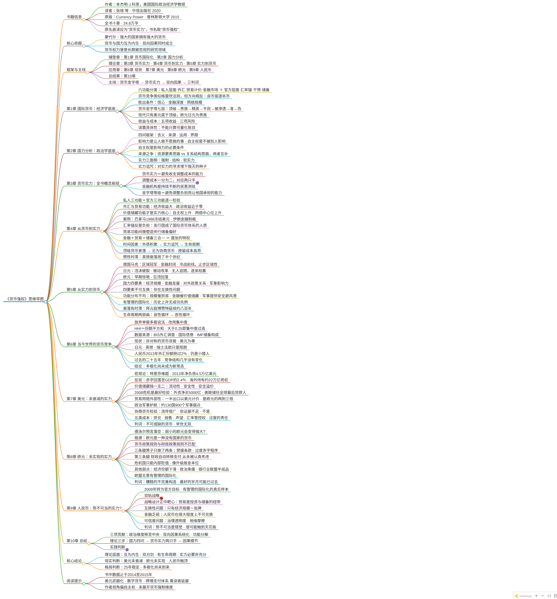

# 《货币强权》读书笔记：框架、脉络与结论

> **📊 全书思维导图**（XMind 式布局 · 高清版可点开放大）

> **书名**：货币强权——从货币读懂未来世界格局
> **作者**：[美] 本杰明·J.科恩（Benjamin J. Cohen，美国加州大学圣塔芭芭拉分校国际政治经济学教授）
> **译者**：张琦、李瑞莹、李奇泽（中国社科院经济研究所）
> **出版社**：中信出版社，2020（原版 *Currency Power: Understanding Monetary Rivalry*，Princeton University Press，2015）
> **ISBN**：9787508679112 ｜ 中译本约 24.8 万字 / 74 节 / 10 章
> **笔记依据**：电子书全文精读（正文逐章提取 + 关键段落原文引用）

> ⚠️ 书名说明：原名 "Currency Power" 最准确的译法是"货币实力"，为突出政治意味译作"货币强权"（译者自注）。文中 power 按语境分别译为权力/国力/实力/力量。

---

## 一、全书定位：它要回答什么问题

开篇引用蒙代尔名言：**"强大的国家拥有强大的货币。"** 全书围绕这句话展开——但方向恰恰相反，作者要追问的是反向的因果链条：

1. 本国竞争力与国际货币地位，究竟何者为因、何者为果？
2. 货币国际化的确是"双刃剑"吗？（收益与成本、时间维度上的反转）
3. 一国货币的崛起/衰落，如何影响世界财富与权力的分配？

作者的核心主张（导言）：**货币与国力互为内生，双向因果同时成立**；且"货币权力"长期是被忽视的研究领域（柯什纳语），本书首次系统化给出分析框架。

**方法论**：把"货币国际化"拆解为多种具体功能，逐一考察与国力的关系（分解法），并补足传统经济学"只算可量化账目"（怀特海所谓**误置具体性谬误**）的缺口。

---

## 二、整体框架：三幕结构

| 部分 | 章节 | 内容 | 角色 |
|---|---|---|---|
| 铺垫 | 第1章 国际货币 | 货币国际化机制、货币金字塔、收益与成本 | 经济学基础 |
| 铺垫 | 第2章 国力分析 | 国力的含义/来源/运用/界限 | 政治学基础 |
| 理论 | 第3章 货币实力 | 调整成本一分为二 → 延迟能力/转移能力"两只手" | 概念枢纽 |
| 理论 | 第4章 从货币到实力 | 货币功能分解（私人3+官方3），哪些功能转化为实力 | 因果：货币→国力 |
| 理论 | 第5章 从实力到货币 | 德国马克/日元/欧元案例，四要素，生命周期论 | 因果：国力→货币 |
| 应用 | 第6章 当今世界的货币竞争 | 用集中度（HHI/CR）实证：25年竞争结构未变 | 实证 |
| 应用 | 第7章 美元：未衰减的实力 | 反驳"美元衰落论"，提出"不可或缺的货币" | 美元判词 |
| 应用 | 第8章 欧元：未实现的实力 | 治理结构缺陷（缺"第三条腿"） | 欧元判词 |
| 应用 | 第9章 人民币：势不可当的实力 | "有管理的国际化"可行但受限 | 人民币判词 |
| 总结 | 第10章 总结 | 三项贡献 + 理论 + 实践展望 | 收束 |

**一条主线**：货币金字塔（等级结构）→ 货币实力（调整成本分配）→ 双向因果（良性/恶性循环）→ 三大货币的现实判词。

---

## 三、逐章脉络与要点

### 导言
- 世界上没有世界货币，运行于近 200 种国家货币的"大杂烩"中；货币竞争呈达尔文式等级化。
- 历史上伟大货币（德拉克马、苏勒德斯、弗罗林、达克特、荷兰盾、比索、英镑、美元）的发行者都是当时的大国；"货币的国际化必然与国家的实力密切相关。"
- 并批：该领域"尚无系统性的理论"，本章以后各章逐步构建。

### 第一章 国际货币（经济学底座）
- **动机**：六功能分类（作者首创）＝货币三职能 × 两层面：私人（外汇买卖、贸易计价与结算、金融市场）+ 官方（汇率之锚、干预货币、储备货币）。
- **选择**：与格雷欣法则相反，"良币驱逐劣币"（网络外部性：用少数货币支撑广阔交易网络，降低两两配对成本）。胜出条件：信心（低通胀）、交易便利与本金确定（深度金融市场）、广泛交易网络（经济规模）。
- **候选**：只有可兑换、具备基本属性的货币才有资格；"先行者优势"巨大（麦金农），路径依赖、切换成本高。
- **货币金字塔**（斯特兰奇四分类扩展为七层）：顶级（现代仅美元）→贵族（欧元、日元）→精英（英镑已跌落至此；瑞士法郎、澳元、加元、兰特）→平民→被渗透→准→伪。"货币金字塔的顶部尖细……塔身向下越来越宽，表示货币的竞争力逐级递减。"
- **收益与成本账目**：五大收益（面额租金/交易成本、国际铸币税+流动性与安全性溢价、宏观弹性="嚣张的特权"、杠杆作用、声誉）；三种风险（汇率升值、对外负债约束、过度的责任）。作者批评麦肯锡等研究"在光线亮的地方找钥匙"，只算可量化项——误置具体性谬误。

### 第二章 国力分析（政治学底座）
- 四问框架：**含义、来源、运用、界限**。
- **含义**：影响力（power over，达尔：让 B 做本不愿做的事）+ 自主权（power to，不被他人影响）；**自主权是影响力的必要条件**（"最好的进攻始于优秀的防守"）。
- **来源**：要素/资源思路（CINC、GPI、CNP 等指数）vs 关系/社会思路（赫希曼→基欧汉与奈的不对称相互依赖→社会网络中心性）；作者认为两者互补。面相：第一（主动强制）、第二（结构实力——"通过修订博弈规则获益"）、第三（软实力：塑造偏好）。
- **运用与界限**：潜在实力问题（成本、国内二阶博弈、可替换性）；不对称相互依赖决定权重；**迦拉罗蒂的"实力诅咒"**——"对实力的寻求往往埋下了使其毁灭的种子。"

### 第三章 货币实力（全书概念枢纽）
- **核心命题**：货币事务中实力皆与自主权相关；**货币实力的最终源泉＝避免收支调整成本的能力**。基准命题：能避免调整成本者，货币实力越大。
- 调整成本一分为二：
  - **持续性调整成本**（新平衡达成后的永久损失，总是全部落在逆差国头上）→ 对应 **延迟能力**（靠财务变量：外汇储备、借款能力；货币国际化＝增强借款能力＝"**无泪赤字**"特权）。
  - **过渡性调整成本**（转变本身的代价，可以转嫁给他人）→ 对应 **转移能力**（靠结构变量：经济开放度【敏感性】与适应性【脆弱性】）。
- 杠杆的运用受"债权人"决定："金融市场就好比持续不断的民意测验"；延迟实力：储备金最优量权衡 + 借债受制于债权人。
- 关联出结论：货币金字塔的等级＝一国避免调整负担而让他国承担的能力。

### 第四章 从货币到实力（因果方向之一）
- 结构：私人层面 3 功能 + 官方层面 3 功能，逐个检验对国力的影响。
- 关键发现：
  - **外汇交易/贸易计价（交易媒介、记账单位功能）**：经济收益大，**政治收益几乎为零**——不涉及长期持有，不增强自主权/网络中心地位（工具货币"纯粹技术性、很容易被取代"）。
  - **金融市场（投资媒介）与储备货币（价值储藏功能）**：才真正增强国力——带来自主权（为赤字融资放松约束）+ 网络中心地位 → 潜在影响力/杠杆（"免费出狱卡"）。案例：1988 巴拿马冻结美元、2011 伊朗金融制裁——"西塞罗：无穷的金钱就是战争的原动力。"
  - **汇率锚**：反而是负担！锚定货币发行国被"钉住"（美国成为"国际货币体系的人质"），汇率管理权转移到追随者手中（斯塔克尔伯格模型是"结构性实力"形式，但不一定有利）。
  - **贸易功能**：政治收益虽小，但通过"塑造中央银行的储备偏好"间接重要——真正关键的是三种：**贸易、投资、储备**。
  - 累积影响：投资功能先于储备功能出现（英镑、美元历史路径）；金融+贸易+储备三合一才是"嚣张的特权"。
- **时间维度**：经常账户赤字并非储备货币的必然（资本账户"借短贷长"即可国际化；英镑、美元早期都是盈余）；但外债积累是真实的腐蚀剂——"实力诅咒"显现，**生命周期**：先是良性循环，后转向恶性循环；顶级货币衰落会沦为**协商货币**（需付出援助、市场准入、军事保护等高昂成本挽留使用者）。
- 时滞：惯性/转换成本使衰落以十年计（克鲁格曼："英国不再是世界头号经济强国之后，长达半个世纪的岁月里，英镑却仍然是世界顶级货币"）。

### 第五章 从实力到货币（因果方向之二）
- 用三个案例归纳国力如何"制造"货币：**德国马克**（经济奇迹+低通胀+欧洲一体化+欧央行主导地位；但金融封闭、政府不愿推动、冷战前沿不安全 → 只达区域地位）；**日元**（经济规模+低通胀+金融自由化；但"市场定价"出口模式、政府被动（日元/美元协议、广场协议）、无一国追随、泡沫破裂 → 1995 年后垂死枯萎）；**欧元**（早期快速启动后见顶；惯性、政策中立、"安全因素"、治理缺陷）。
- **四个实力要素**：经济规模、金融发展水平、对外政策关系、军事影响力——缺一不可（"伟大的货币不会出身于小国或弱国"，但集齐也未必成功：**竞争结构/在位者优势 + 惯性**）。
- **功能的非均衡分布**：经济规模 → 贸易功能；金融发展 → 价值储藏功能；对外政策关系 → 官方功能（锚/干预/储备）；军事影响力 → 提供"安全避风港"即软实力。
- **"有管理的国际化"**：非正式领导（提升货币品牌：稳定政策、金融深化、网络外部性）与正式领导（胡萝卜加大棒：宗主国货币/协商货币），手段多样，但"并无成功的先例"——受制于成本、国内政治抵制、**互换性问题**（目标与工具不匹配；日本"大爆炸"失败是惨痛例证）。
- **地缘政治衰落**：货币"国内化/非国际化"是所有伟大货币的最终归宿（博赞特延续约八百年！）；衰落有时滞、路径依赖，但"没有被替代的高质量货币"才会持久。
- 结论：六个要点见文末结论部分。

### 第六章 当今世界的货币竞争（实证）
- 批判"单极/多极"粗糙；引入**集中度**（CR2/CR5 + HHI：所有份额平方和 > 0.25 视为过高；极性的可操作定义：单极 50%、接近单极 45~50%、双极 50/25）。
- 数据（BIS 外汇 1989-2013、国际债券、COFER 储备 2005-2013）：只有**美元、欧元**两个主导；日元、英镑、瑞士法郎是"陪跑"；人民币 2013 年外汇份额"刚过 2%"（2004 年不足 0.1%），"仍然是个人小矮人"。现状 = **"非对称的货币双极性"**（美元在外汇、储备份额是欧元两倍以上）。
- 结论：**25 年竞争结构几乎没变，HHI 自 1992 年反而小幅净上升**。"多极化尚未成为新常态。"

### 第七章 美元：未衰减的实力
- 悲观主义史：特里芬难题（1944 金汇兑→1971 关闭黄金窗口）→ 净负债 4.5 万亿美元（2013）、"史上最大的债务国"；但作者反驳：赤字已回落至 GDP 2.4%、海外持有约 22 万亿债权，"家底殷实"。
- **为什么外国人还买美元**：
  1. **价值储藏优势独一无二**：深度、开放、弹性极强的金融市场；"储蓄者诅咒"（流动性溢价）；美债体系 8 万亿+、日交易 5000 亿；安全溢价——"美国是能够以任何所需的规模，提供兼具安全性和流动性的投资级别资产的唯一来源"。
  2. **2008 危机是最好检验**：震中在美国，但危机中外国净买 5000 亿美元资产、美元升值、美联储做全球最后贷款人（互换 5800 亿）。
  3. 其他优势：贸易网络外部性（约一半出口以美元计价，是欧元 2-3 倍）、政治同盟（130 国 900 座军事据点）、"美国的经济实力并未下降——它已经全球化了"（结构实力/控制能力）。
- **"协商货币"检验**：结论是**否**——"美元正在变成一种协商货币的看法，或许流传得很广，但并未得到现有证据的支持。"（历史上确有 1967 布雷辛信件、1973 沙特交易，但当代无证据）
- 负面因素（成本）：挤兑风险、储备抛售（最大美元持有者变成中国等"亦友亦敌"）、声望受损观感、汇率管控权部分丧失（威廉姆森："作为回报，其他国家在汇率管理方面获得了完全的自由"）、过度的责任（2008 互换的恐怖平衡）。
- 判词：**"美元是举世无双的"、"世界上不可或缺的货币"**；净收益"不像很多人认为的那么多"，但"死亡报道被严重夸大了"。

### 第八章 欧元：未实现的实力
- 出生时的预言（德洛尔："弱小的欧元将变得强大"）落空：2008 后国际化见顶回落，债券份额从 1/3 降到 1/4，储备从 27% 降到 23%，仍远低于美元。
- **根子在治理结构**：欧元是"一种没有国家的货币"；"欧盟货币政策规则与财政政策规则之间的不匹配"——货币归欧洲央行，预算留在各国政府。
- 对照美国"三条腿的凳子"（自动转移支付／赤字限制／无紧急援助；汉密尔顿-葛兰姆路径），欧洲只有两条腿（禁援条款+"过度赤字程序"），**第三条腿——财政自动转移支付——"从来都没有认真考虑过"**；危机后"内部贬值"，像"升级版的没有黄金的金本位制"，经济被钉死在"欧元十字架"上。
- 其他弱点：经济份额降至 18%、老龄化；缺少媲美美债的资产；银行业联盟"半生不熟"；军力是"政治上的侏儒"。
- 欧盟无意"有管理的国际化"（德国担心货币政策受制于人）→ "欧元的前景就极有可能由市场竞争的逻辑来决定。"
- 判词：**力量"仍未实现"、"最好的岁月可能已经过去"**；是"一个糟糕的不完善构造"。

### 第九章 人民币：势不可当的实力？
- 中国把货币国际化定为官方目标（2009 年转向）："深思熟虑的影响力图谋"，"有管理的国际化"的真实样本。
- **双轨战略**：贸易路径（26 个经济体互换 2.7 万亿、2009 年跨境结算试点、清算行/直接交易机制；2014 年底约 20% 贸易以人民币结算）+ 金融路径（2004 香港业务、2010 CNH 离岸市场、点心债、熊猫债券）。
- 战略设计"正中靶心"（贸易为投资、储备的纽带），但方法受制于**互换性问题**：四项实力要素中**只有经济规模一张牌**；金融乏弱（人民币在很大程度上不可兑换、香港"小马拉大车"）、政治无吸引力（治理透明度与"可信度问题"、军事扩张与领土争端）。
- 判词：**"势不可当"是错觉**。国家确能"制造"国际性货币——"亚洲金融危机的经验对中国的启示……贸易路径已见实效"（东亚渐成"人民币集团"）；但"货币国际化并非轻而易举之事，也不可能以低成本获得"——需要金融自由化与经济模式重大修正，"人民币很可能触到了天花板"。

### 第十章 总结
- **三项贡献**：①政治维度移至舞台中央；②系统探究货币—国力因果关系（互为内生、双刃剑、时间因素）；③分解功能角色。
- **理论**：三步构建（国力四问 → 货币实力两只手 → 因果细节：实力必要非充分、资源不可互换、生命周期）。
- **实践**：金字塔集中率 25 年未变；美元仍主导、欧元"完全不是对手"、人民币"有管理的国际化前景有限"；"在可预见的未来，美元仍将保持其至高无上的地位。"

---

## 四、核心概念体系（速查）

| 概念 | 定义/要点 |
|---|---|
| 货币金字塔 | 七层：顶级/贵族/精英/平民/被渗透/准/伪；顶级=现代美元、一战前英镑 |
| 货币国际化（六功能） | 私人：外汇交易、贸易计价结算、金融市场；官方：汇率锚、干预货币、储备货币 |
| 货币实力 | 避免收支调整成本的能力；本质是自主权，两只手：**延迟能力**（财务变量：储备+借款）与**转移能力**（结构变量：开放度+适应性） |
| 持续性/过渡性调整成本 | 新平衡的永久损失（全归逆差国）/转变本身的代价（可转嫁） |
| 无泪赤字 | 以本币为赤字融资、无须偿还压力——货币国际化的直接红利 |
| 嚣张的特权 vs 过度的责任 | 德斯坦：国际货币发行国的政策自主；但锚定、信任责任随之而来 |
| 协商货币 | 靠劝说/外交/条件维持地位的货币（斯特兰奇分类）；为衰落中的顶级货币的最终形态 |
| 实力诅咒 | 迦拉罗蒂：对实力的寻求埋下毁灭的种子；外债累积、善意忽视 |
| 良性/恶性循环 | 生命周期两阶段：实力→货币→实力 的自我强化与自我否定 |
| 集中度（HHI） | 份额平方和；>0.25 集中度过高；货币体系 HHI 稳定且略升 |
| 货币错配 | 未在本书中成焦点（见第九章）；书中以"储蓄者诅咒/本币计价"表述 |
| 互换性问题 | 实力资源与货币功能"目标-工具"不匹配：如只有经济规模，推不动价值储藏功能 |

---

## 五、核心结论（一页速览）

**理论层面**
1. 货币与国家实力**互为内生**、双向因果同时成立（第四章与第五章合证）。
2. 货币国际化是**双刃剑**：收益与成本随时间和负债积累易位；任何货币都有生命周期，"从来没有哪种货币可以一直占据主导地位"。
3. 货币国际化的**功能分解**决定价值：只有金融、贸易、储备其中之三（尤其是价值储藏两功能）才真正转化为实力。
4. 国家实力是货币国际化的**必要条件而非充分条件**；四要素（经济规模、金融发展、对外政策关系、军事影响力）不可互换；在任者的惯性优势难以撼动。

**现实判断（截至 2015 视角）**
5. **美元**：实力未衰减、不可或缺、尚非协商货币；"死亡报道被严重夸大了"。
6. **欧元**：有潜力但未实现——治理结构性缺陷（缺第三条腿）；最好的岁月可能已过。
7. **人民币**：崛起并非势不可当——只有经济规模一张牌，触到天花板的风险高。
8. **总体**：25 年格局稳定，多极化"尚未成为新常态"；**"在可预见的未来，美元仍将保持其至高无上的地位。"**

---

## 六、本书的局限与阅读提示

- 数据截至 2014-2015 年（BIS 2013、COFER 2014 末），后续美元加息周期、2022 年俄罗斯外汇储备冻结、美元武器化、数字货币/稳定币、跨境支付（CIPS/BRICS 结算）等新变局需读者自行延展。
- 作者将"货币实力"定义为自主权（调整成本能力），有意排除"货币武器化"的强制维度（那是柯什纳路线）；审读时可对照当前美元制裁实践。
- 对日、欧、中的判断是在其"鼎盛期对比"的背景下做出的，注意"欧元未实现的实力"与"人民币触顶"两判断都曾遭遇（或被验证于）其后实际走势——2015 年后欧元份额进一步回落而人民币储备份额缓升但远低于预期，大体印证作者的谨慎而非狂热。

---

## 附录：术语速查

BIS 国际清算银行｜COFER 官方外汇储备货币构成（IMF）｜HHI 赫芬达尔-赫希曼指数｜SDR 特别提款权｜CNH 离岸人民币 / CNY 在岸人民币｜PBOC 中国人民银行｜EMU 欧洲经济货币联盟｜EFSF/ESM 欧洲金融稳定基金/欧洲稳定机制｜OMT 货币直接交易（德拉吉）｜CINC 国家能力合成指数｜CNP 综合国力（中国）｜IPP/IPE 国际政治经济

*（笔记完。如需按章节展开、对比表、思维导图或与卢麒元框架的对照分析，可再细化。）*
